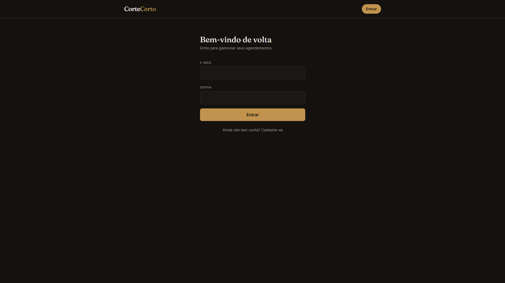
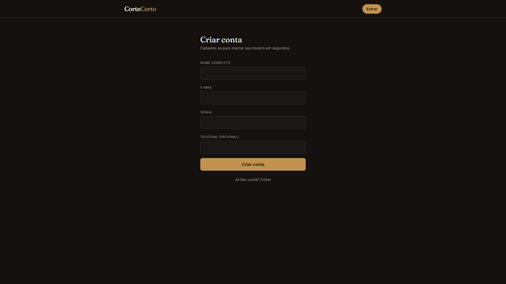
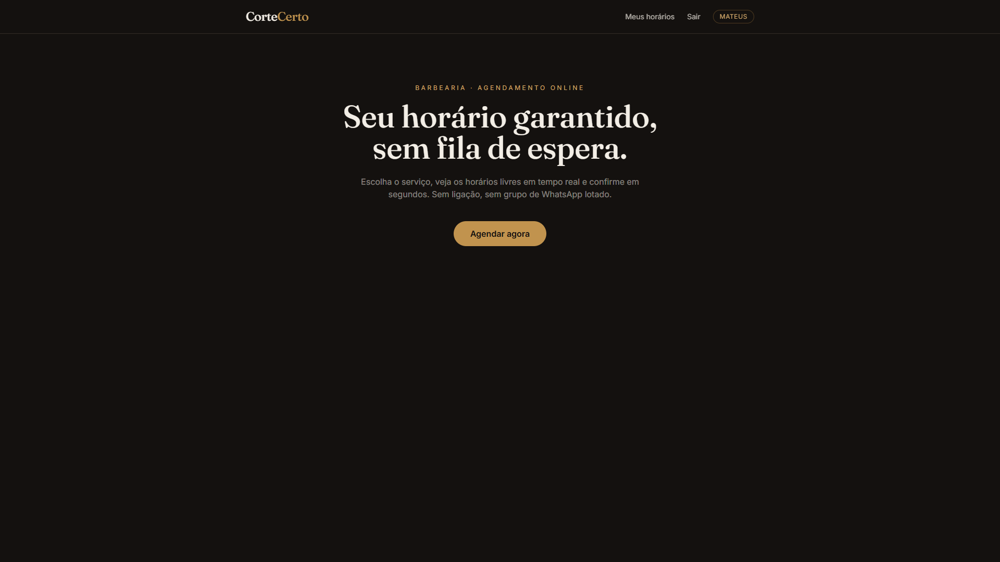
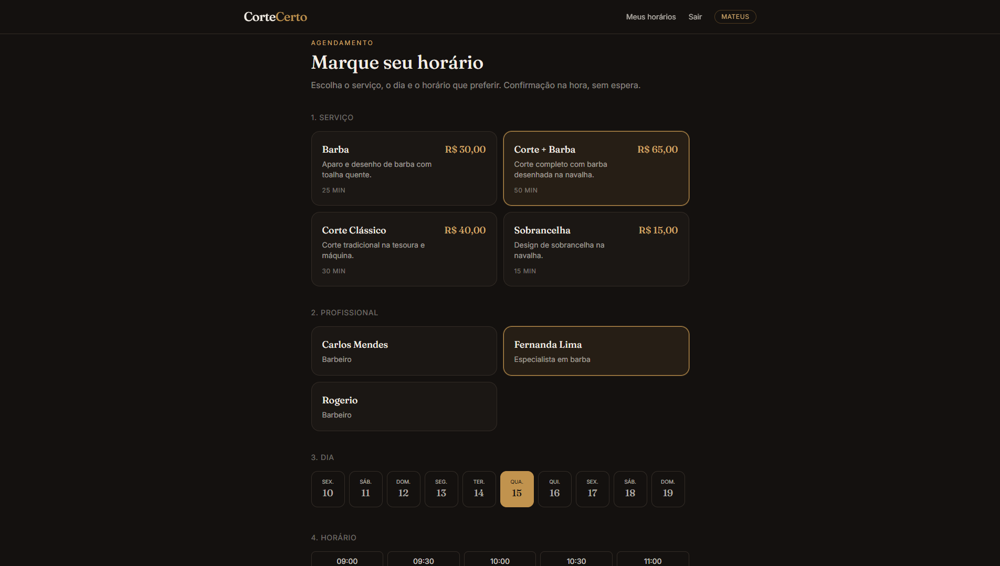
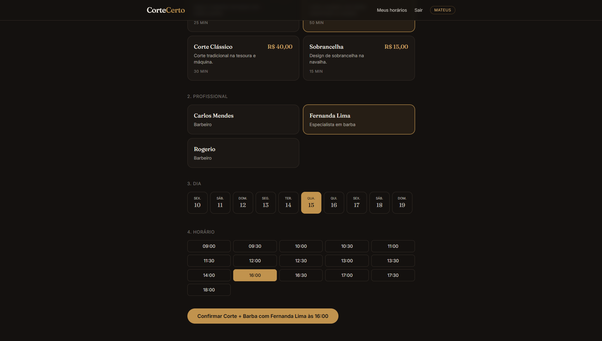

# Corte Certo — Sistema de Agendamento para Barbearias

Aplicação full-stack de agendamento online, desenvolvida para resolver um problema real: eliminar
a fila de WhatsApp e as ligações para marcar horário em barbearias e salões pequenos.

O cliente escolhe o serviço, vê os horários realmente disponíveis em tempo real e confirma o
agendamento em poucos cliques. O dono do negócio acompanha a agenda do dia e a receita prevista
em um painel dedicado.

## Funcionalidades

**Área do cliente**
- Cadastro e login obrigatórios com autenticação JWT — nenhuma tela é acessível sem login,
  e o sistema redireciona de volta para onde o usuário estava indo assim que autentica
- Listagem de serviços com duração e preço
- Escolha do profissional que vai atender
- Calendário dos próximos 10 dias
- Grade de horários disponíveis, calculada dinamicamente a partir da duração do serviço
  e da agenda **daquele profissional específico**
- Confirmação de agendamento com validação de conflito em tempo real
- Notificação por e-mail ao confirmar ou cancelar, e um botão de "Enviar por WhatsApp"
- Histórico de agendamentos com opção de cancelamento

**Painel do parceiro (admin)**
- Agenda do dia com todos os agendamentos confirmados, com filtro por profissional
- Total de agendamentos e receita prevista do dia
- Gestão de serviços e de profissionais (criar, editar, desativar)

## Por que este projeto é tecnicamente interessante

O núcleo do sistema é a **lógica de prevenção de conflito de horários**, que resolvi em duas
camadas:

1. **Na API**, antes de tocar o banco: dado um horário de início e a duração do serviço, o sistema
   verifica se o intervalo `[início, fim)` se sobrepõe a qualquer agendamento já confirmado no
   mesmo dia (`backend/src/utils/conflict.js`). Essa mesma função gera a lista de horários livres
   exibida ao cliente, então o front-end nunca mostra um horário que o back-end recusaria.
2. **No banco**, como rede de segurança: uma constraint `@@unique([date, startTime])` no Prisma
   garante que, mesmo em caso de duas requisições simultâneas passando pela validação da API ao
   mesmo tempo, o banco rejeita a segunda gravação.

A checagem de conflito é **por profissional**: a constraint do banco é
`@@unique([professionalId, date, startTime])`, não apenas `[date, startTime]`. Isso permite que dois
profissionais atendam clientes diferentes no mesmo horário — sem essa mudança, o sistema recusaria
agendamentos legítimos assim que a barbearia tivesse mais de um profissional trabalhando.

As notificações (`backend/src/lib/notifications.js`) são desacopladas do provedor: e-mail usa
Nodemailer, que em desenvolvimento (sem credenciais SMTP no `.env`) só imprime a mensagem no console,
e em produção basta preencher `SMTP_HOST`/`SMTP_USER`/`SMTP_PASS` para enviar de verdade. O WhatsApp
usa link `wa.me` com mensagem pré-preenchida — a abordagem padrão para pequenos negócios, já que a
API oficial do WhatsApp Business exige conta comercial aprovada.

Outras decisões técnicas:
- Preços armazenados em **centavos (inteiro)**, não float, para evitar erros de arredondamento.
- Senhas com hash **bcrypt**, nunca armazenadas em texto puro.
- Validação de entrada com **Zod** em todas as rotas que recebem dados do usuário.
- Autorização por papel (`CLIENT` / `ADMIN`) via middleware, não apenas por convenção no front-end.

## Stack

**Back-end:** Node.js · Express · Prisma ORM · PostgreSQL · JWT · bcrypt · Zod
**Front-end:** React · Vite · React Router · Tailwind CSS · Axios

## Estrutura do projeto

```
agenda-barbearia/
├── backend/
│   ├── prisma/
│   │   ├── schema.prisma      # modelagem de User, Service e Appointment
│   │   └── seed.js            # dados de exemplo
│   └── src/
│       ├── routes/            # auth, services, appointments
│       ├── middleware/        # autenticação e autorização JWT
│       ├── utils/conflict.js  # lógica de validação de conflito de horário
│       └── server.js
└── frontend/
    └── src/
        ├── pages/              # Landing, Login, Booking, MyAppointments, AdminDashboard
        ├── components/         # Header, ServiceCard, TimeSlotPicker
        └── api.js               # cliente Axios com interceptor de token
```

## Fotos do projeto








---

Desenvolvido por Mateus Novis Amolinário de Marins.